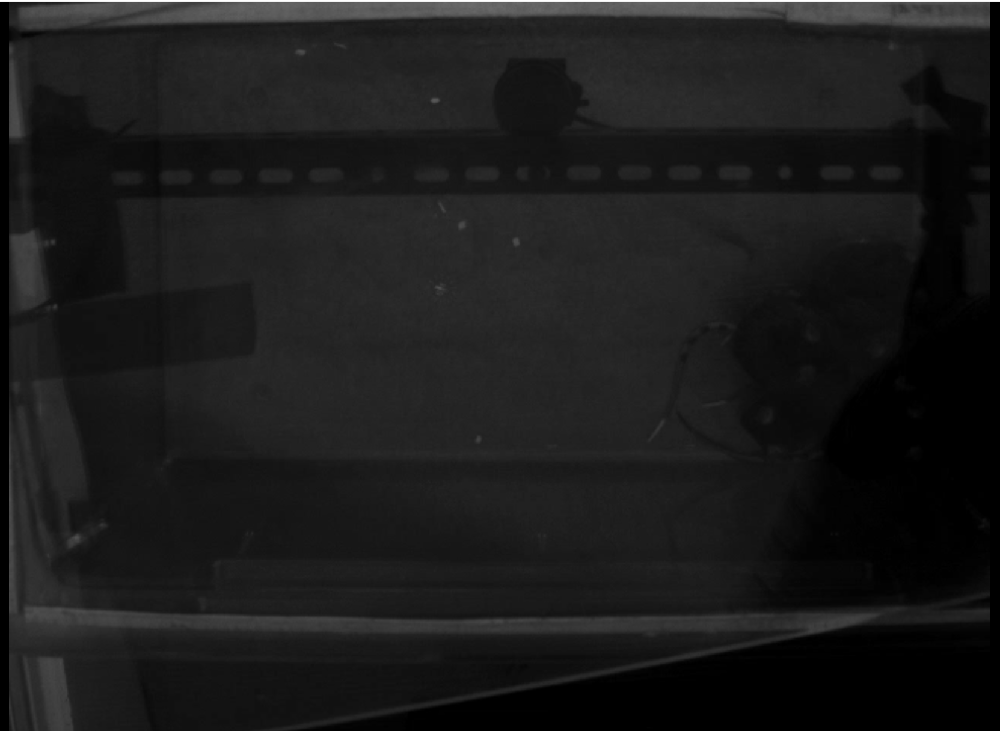
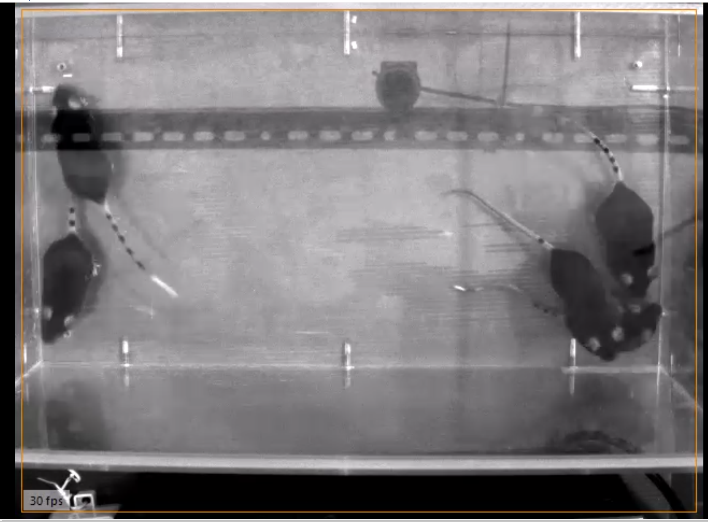
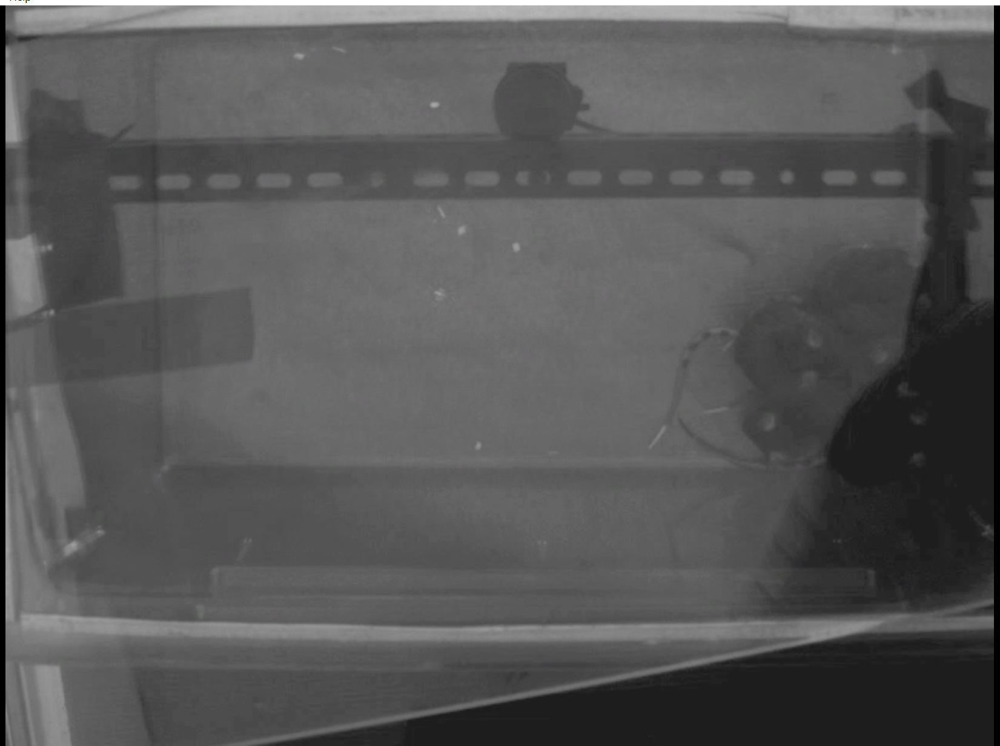
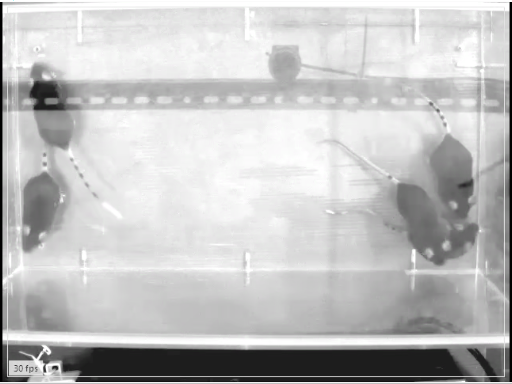
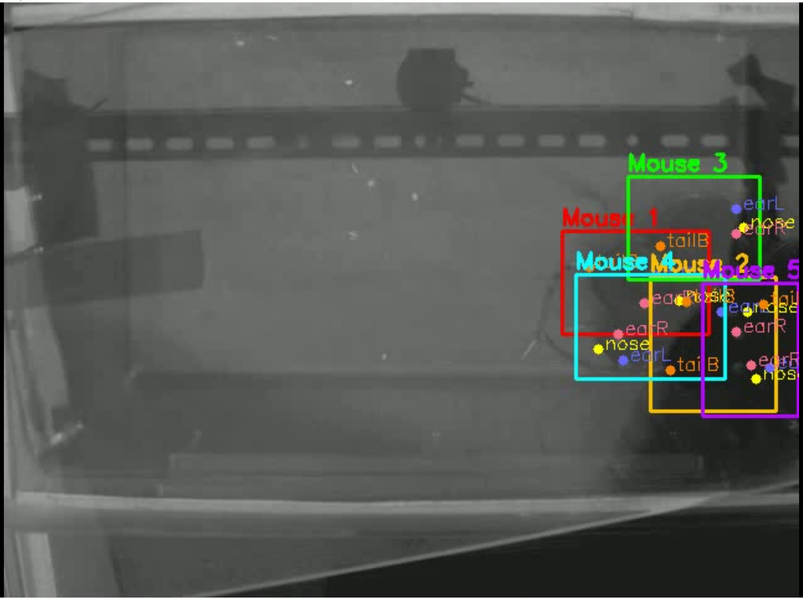
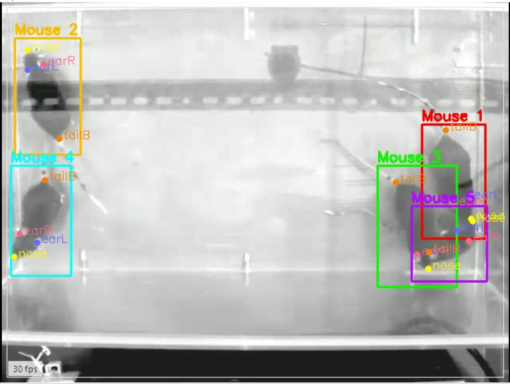
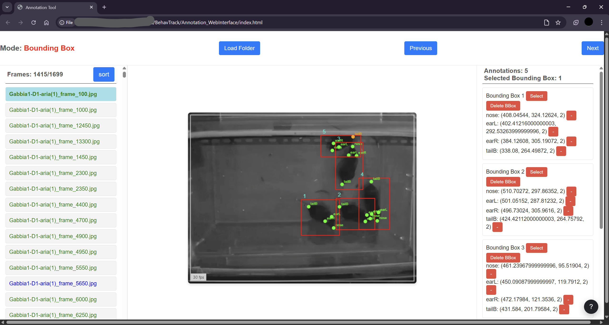

# BehavTrack: Active Learning & Tracking Framework for Mouse Behavior

BehavTrack is a modular framework for efficient annotation, training, and tracking of mice in behavioral videos using active learning and YOLO-based detection. It combines Python scripts/notebooks for data processing and model training with a lightweight, custom web interface for annotation.
|Type |   |   | |
|---|---|---|---|
|Raw||| |
|Pre-Processed||| |
|Result||||

## Why BehavTrack?

Manual annotation of rodent behavior is expensive and time-consuming (especially when there are more than 3 rodents per recordings). BehavTrack uses active learning to minimize labeling effort while maintaining high performance. It is designed for researchers who want to:

- Efficiently annotate large video datasets with 

- Use modern YOLO models for detection

- Track individual animals across frames

- Iterate annotation–training cycles to steadily improve accuracy

## Project Context & Goals

This framework was designed to streamline behavioral analysis in rodent studies, especially when manual annotation is costly and time-consuming. BehavTrack leverages active learning to minimize annotation effort while maximizing model performance. It is ideal for researchers who want to:
- Efficiently annotate large video datasets
- Use state-of-the-art YOLO models for detection
- Track individual animals across frames
- Iterate annotation and training cycles for improved accuracy

## Workflow Overview


1. **Preprocess** videos (frame rate, resolution, color space, duration).
2. **Stratified frame sampling** to build a balanced pool for annotation/training.
3. **Initial split** into a held-out test set and an active-learning pool.
4. **Manual annotation** of the test set via the web interface (for evaluation).
5. **Active Learning Pool Split**: From the active-learning pool, create train+val, prediction, and reserve subsets.
6. **Label** the initial train+val subset via the web interface.
7. **Train YOLO** on train+val, infer on the prediction subset.
8. **Evaluate** on the held-out test set.
9. **Active-learning loop**: correct predictions → add to train+val → draw new stratified subset from the reserve pool → repeat (Steps 5–9).
10. Once performance is satisfactory, run **full tracking** on all videos.

## Directory Structure

```bash
.
├─ src/                         # Python modules 
├─ Annotation_WebInterface/     # HTML/CSS/JS annotation UI (open in Chromium-based browser)
├─ imgs/                        # Example images and workflow diagram
├─ yolo_dataset.yaml            # YOLO data config (update 'path' per cycle)
├─ requirements.txt             # Python dependencies
├─ al_s1_pre_proccessing.ipynb
├─ al_s2_stratified_frame_sampling.ipynb
├─ al_s3_intial_split.ipynb
├─ al_s5_p1(intial)_anno-vs-al_split.ipynb
├─ al_s5_p1(post-training)_anno-vs-al_split.ipynb
├─ al_s5_p2_convert_to_yolo_labels.ipynb
├─ al_s7_p1_train_yolo.ipynb
├─ al_s7_p2_predict_predictions-frames.ipynb
├─ al_s7_p3_convert_predictions.ipynb
├─ yolo_video_inference.ipynb
└─ custom_tracking.ipynb
```
> __Note on the two “s5_p1” notebooks__ 
> + __Use `al_s5_p1(intial)_anno-vs-al_split.ipynb` only once in the very first cycle.__
> + __For subsequent cycles, use `al_s5_p1(post-training)_anno-vs-al_split.ipynb`.__


## Annotation Web Interface



- **Features**
    - Draw **bounding boxes** (one per mouse; default assumption: **5 mice per frame**).

    - Add **keypoints** per box: `nose`, `earL`, `earR`, `tailB` (4 per mouse).

    - Mark boxes as manual or treat them as **predictions** to correct.

    - Sorting and progress view; highlight and select specific boxes; remove keypoints/boxes.

    - **Help panel** with color legend and keyboard shortcuts.

- **Usage**

    1. Open `Annotation_WebInterface/index.html` in a *Chromium-based* browser (Chrome/Edge/Brave).

    2. Click **Load Folder** and select a directory with images.
        - If missing, an `annotation.json` file is created automatically.

    3. Draw boxes and add keypoints. Save progress (`Ctrl+S`) as needed.

    4. Colors in the file list:
        - **Green**: fully annotated (manual)
        - **Blue**: contains predictions (not fully manual)
        - **Orange**: partially annotated
        - **Black**: no annotations

- **Keyboard shortcuts**
    - **Ctrl + Alt** — Toggle mode and cycle keypoints (bbox → keypoint1 → … → bbox)
    - **Ctrl + X** — Toggle keypoint visibility flag (1 ↔ 2)
    - **Ctrl + S** — Save annotations
    - **H** — Open/close the Help panel
    - (Optional) **Ctrl + Z** — Undo (wire up if you enable it, as it is commented-out at the moment)

> The UI expects 5 boxes × 4 keypoints per frame by default. You can change these assumptions in the code if your setup differs.

## Jupyter Notebooks (Step-by-Step)
1. [`al_s1_pre_proccessing.ipynb`](al_s1_pre_proccessing.ipynb) - Preprocess videos (frame rate, resolution, grayscale, duration).
2. [`al_s2_stratified_frame_sampling.ipynb`](al_s2_stratified_frame_sampling.ipynb) - Stratified frame selection (balanced pool).
3. [`al_s3_intial_split.ipynb`](al_s3_intial_split.ipynb) - Split into test vs active-learning pool.
4. [Annotate](/Annotation_WebInterface/index.html) the test split with the web interface.
5. [`al_s5_p1(intial)_anno-vs-al_split.ipynb`](al_s5_p1(intial)_anno-vs-al_split.ipynb) - One-time initial active-learning setup (train/val/predict/reserve) and then [Annotate](/Annotation_WebInterface/index.html) the train and val splits.
    - For later cycles use [`al_s5_p1(post-training)_anno-vs-al_split.ipynb`](al_s5_p1(post-training)_anno-vs-al_split.ipynb).
6. [`al_s5_p2_convert_to_yolo_labels.ipynb`](al_s5_p2_convert_to_yolo_labels.ipynb) - Convert annotations → YOLO labels.
7. [`al_s7_p1_train_yolo.ipynb`](al_s7_p1_train_yolo.ipynb) - Train YOLO model.
    - **Important**: Update [`yolo_dataset.yaml`](/yolo_dataset.yaml) (`path:` to the current cycle’s dataset).
8. [`al_s7_p2_predict_predictions-frames.ipynb`](al_s7_p2_predict_predictions-frames.ipynb) - Predict on the “prediction” subset.
9. [Annotate](/Annotation_WebInterface/index.html): Fix predicted labels via the web interface.
10. [`al_s7_p3_convert_predictions.ipynb`](al_s7_p3_convert_predictions.ipynb) - Merge predictions with manual annotations. After completion go back to step 5 (if the results are not at the desired level.)
11. [`yolo_video_inference.ipynb`](yolo_video_inference.ipynb) - Run full video inference and tracking.
12. [`custom_tracking.ipynb`](custom_tracking.ipynb) - Post-processing and identity tracking refinement.

> [`copy_data.ipynb`](/copy_data.ipynb) - to copy only `aria`, `eCig-pre` and `Cig-pre` recordings from the source dir to the destination dir.

## Installation
```bash
# Create a virtual environment (recommended)
python -m venv .venv
source .venv/bin/activate         # Windows: .venv\Scripts\activate

# Install Python dependencies
pip install -r requirements.txt
```

**Hardware**
- A CUDA-capable GPU is strongly recommended for training and inference (NVIDIA GPU + recent CUDA/cuDNN).
- CPU-only is possible for parts of the pipeline but will be slow.

## Quick Start

1. **Prepare videos** and run preprocessing ([`al_s1_pre_proccessing.ipynb`](al_s1_pre_proccessing.ipynb)).

2. **Sample frames** ([`al_s2_stratified_frame_sampling.ipynb`](al_s2_stratified_frame_sampling.ipynb)).

3. **Split** test vs active-learning ([`al_s3_intial_split.ipynb`](al_s3_intial_split.ipynb)).

4. **[Annotate](/Annotation_WebInterface/index.html) test** via the web UI → evaluate.

5. **Initial AL split** ([`al_s5_p1(intial)_...`](/al_s5_p1(intial)_anno-vs-al_split.ipynb)) → **[annotate](/Annotation_WebInterface/index.html) train+val** → **train** ([`al_s7_p1_...`](/al_s7_p1_train_yolo.ipynb)).

6. **Predict** on “prediction” frames ([`al_s7_p2_...`](/al_s7_p2_predict_predictions-frames.ipynb)) → **correct** in [web UI](/Annotation_WebInterface/index.html) → **merge** ([`al_s7_p3_...`](/al_s7_p3_convert_predictions.ipynb)).

7. Repeat **AL cycle** using [`al_s5_p1(post-training)_...`](/al_s5_p1(post-training)_anno-vs-al_split.ipynb) until performance is satisfactory.

8. **Track full videos** ([`yolo_video_inference.ipynb`](/yolo_video_inference.ipynb), [`custom_tracking.ipynb`](/custom_tracking.ipynb)).


## Configuration Notes

- [`yolo_dataset.yaml`](/yolo_dataset.yaml) <br />
    Update the path: field each cycle to point to the current dataset (train/val/test).

- **Number of mice / keypoints** <br />
    The default is **5 mice × 4 keypoints** (nose, earL, earR, tailB). <br/>
    If your experiment differs, adjust:
    - Annotation UI expectations.
    - Label export (YOLO formatting).
    - Tracking parameters (`max_ids`) and keypoint lists.

- **Visibility flag**
    Keypoints store a visibility indicator: `1 = not clearly visible, 2 = visible`.

## Tips & Best Practices

- Keep preprocessing **consistent** (fps, resolution, grayscale) to stabilize training.

- Use the web interface primarily to correct predictions: it’s faster than labeling from scratch.

- Store intermediate **metadata JSONs** (splits, detections) to make cycles reproducible.

- Start with a **small initial labeled set**, then iterate with active learning.

- For tracking, tune:

    - Cost weights (`alpha`, distance vs IoU).

    - Visibility threshold for keypoints.

    - Maximum allowed frame skips (`framesSkip_limit`).

    - `max_ids` to match the number of animals present.

## Troubleshooting

- **Web interface can’t access files** <br />
    Use a **Chromium-based** browser and allow local file access. The UI uses the File System Access API.

- **YOLO training errors** <br />
    Check paths in `yolo_dataset.yaml`, ensure images/labels align, and confirm GPU drivers are installed.

- **Slow inference/training** <br />
    Ensure you’re using GPU acceleration; for ffmpeg preprocessing, confirm hardware codec flags are supported.

- **Tracking inconsistencies**
    Try adjusting `alpha`, `cost_threshold`, `release_id_at_value`, and `framesSkip_limit`. Verify that detections are not exceeding `max_ids`.


## Acknowledgments

- Built around [**Ultralytics YOLO**](https://docs.ultralytics.com/models/yolo11/) for detection.

- Inspired by common active-learning loops used in vision research.

