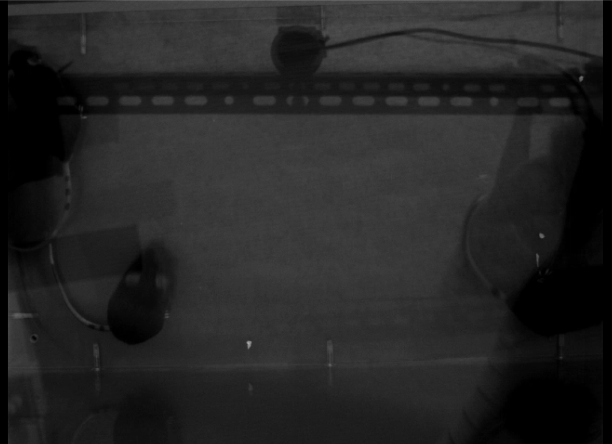
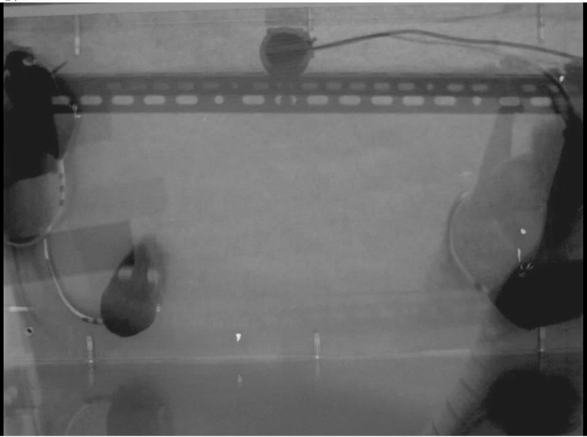
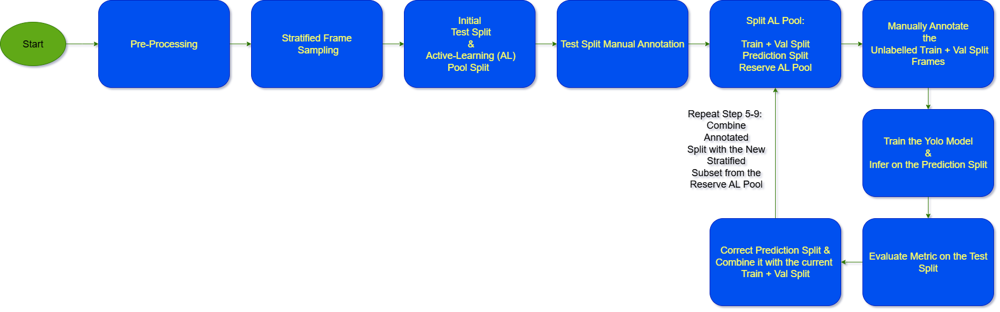

# BehavTrack: Active Learning & Tracking Framework for Mouse Behavior

BehavTrack is a modular framework for efficient annotation, training, and tracking of mice in behavioral videos using active learning and YOLO-based detection. It combines Python scripts/notebooks for data processing and model training with a custom web interface for annotation.
|Raw |  Pre-Processed | Result  |
|---|---|---|
|  |   | |   


## Project Context & Goals

This framework was designed to streamline behavioral analysis in rodent studies, especially when manual annotation is costly and time-consuming. BehavTrack leverages active learning to minimize annotation effort while maximizing model performance. It is ideal for researchers who want to:
- Efficiently annotate large video datasets
- Use state-of-the-art YOLO models for detection
- Track individual animals across frames
- Iterate annotation and training cycles for improved accuracy

## Workflow Overview



1. **Preprocessing**: Standardize video frame rate, resolution, color space, and duration.
2. **Stratified Frame Sampling**: Select a balanced set of frames for annotation and training.
3. **Initial Split**: Divide frames into a held-out test set and an active learning pool.
4. **Manual Annotation**: Annotate the test set using the web interface for evaluation.
5. **Active Learning Pool Split**: Create initial labeled (train+val), prediction, and reserve sets.
6. **Label Initial Set**: Annotate train+val frames via the web interface.
7. **Train YOLO Model**: Train on annotated data, infer on prediction set.
8. **Evaluate**: Compare predictions to manual annotations on the test set.
9. **Active Learning Cycle**: Correct predictions, add to train+val, repeat steps 5–9 until performance is satisfactory.
10. **Full Tracking**: Use the trained model to track and annotate all videos.

## Directory Structure

- `src/`: Python modules for preprocessing, sampling, splitting, training, prediction, and tracking.
- `Annotation_WebInterface/`: HTML/CSS/JS web interface for annotation.
- Jupyter notebooks (`al_s*_*.ipynb`): Each notebook corresponds to a workflow step.
- `imgs/`: Example images and workflow diagram.
- `requirements.txt`: Python dependencies.

## Annotation Web Interface

- **Features**: Annotate bounding boxes and keypoints (nose, earL, earR, tailB) per mouse.
- **Usage**:
  - Open `index.html` in a Chromium-based browser.
  - Load a folder of images (and optionally an `annotation.json`).
  - Annotate each frame: draw bounding boxes, add keypoints, mark as manual or prediction.
  - Save annotations to `annotation.json`.
  - Keyboard shortcuts and help panel available.
- **Colors**:
  - Green: fully annotated
  - Blue: contains predictions
  - Orange: partially annotated
  - Black: no annotations

### Annotation Details

- Each frame should have 5 bounding boxes (one per mouse) and 4 keypoints per box.
- Keypoints: nose, left ear, right ear, tail base.
- Manual annotations are marked in red; predictions in blue.
- The interface supports undo, sorting, and progress tracking.

## Jupyter Notebooks

Each notebook is named by workflow step:
- `al_s1_pre_proccessing.ipynb`: Preprocess videos.
- `al_s2_stratified_frame_sampling.ipynb`: Stratified frame selection.
- `al_s3_intial_split.ipynb`: Initial split into test and active learning pool.
- `al_s5_p1(intial)_anno-vs-al_split.ipynb`: Prepare active learning/annotation splits.
- `al_s5_p1(post-training)_anno-vs-al_split.ipynb`: Post-training split for next cycle.
- `al_s5_p2_convert_to_yolo_labels.ipynb`: Convert annotations to YOLO format.
- `al_s7_p1_train_yolo.ipynb`: Train YOLO model.
- `al_s7_p2_predict_predictions-frames.ipynb`: Predict on unlabeled frames.
- `al_s7_p3_convert_predictions.ipynb`: Merge predictions and manual annotations.
- `yolo_video_inference.ipynb`: Run inference and tracking on videos.
- `custom_tracking.ipynb`: Post-process YOLO predictions for tracking.

## How to Use

1. **Install dependencies**:
	```bash
	pip install -r requirements.txt
	```
2. **Follow the notebooks in order**:
	Each notebook guides you through a workflow step. Fill in paths and parameters as needed.
3. **Annotate frames**:
	Use the web interface to annotate frames as required by the workflow.
4. **Train and evaluate**:
	Use the provided scripts/notebooks to train YOLO, predict, and evaluate.
5. **Iterate**:
	Repeat the active learning cycle until satisfactory results are achieved.

## Tips & Best Practices

- The web interface is optimized for manual annotation and correction of predictions.
- All annotation and split metadata is stored in JSON files for reproducibility.
- The framework is modular: you can adapt or extend each step for your own dataset or species.
- For best results, ensure consistent video preprocessing and annotation quality.

## Troubleshooting & Support

- If you encounter issues with the web interface, use a Chromium-based browser and check for permission to access local files.
- For Python errors, ensure all dependencies are installed and paths are correctly set in notebooks.
- Refer to the workflow diagram in `imgs/workflow.png` for a visual overview.

